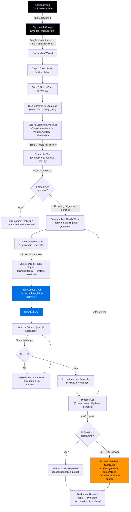
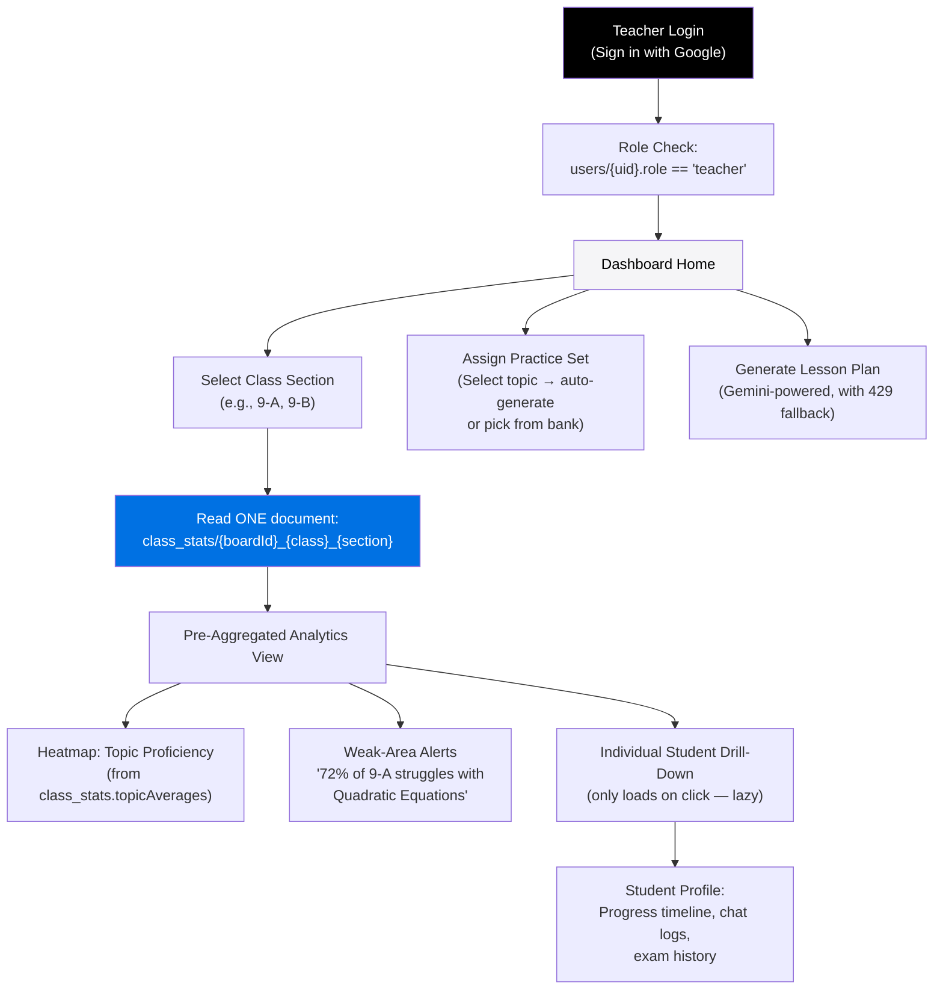
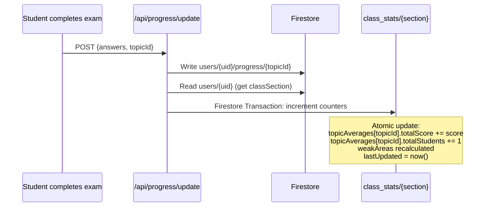
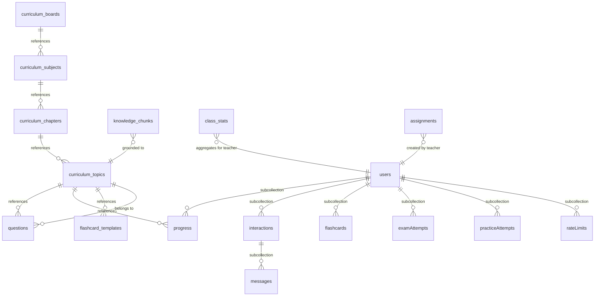
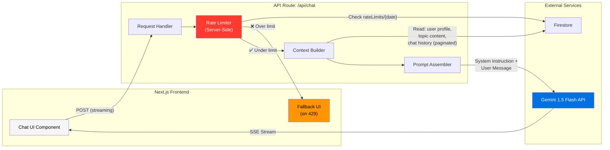
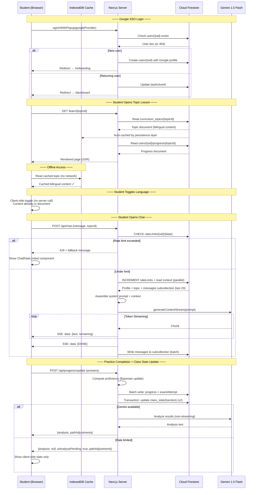

# Prof. Curious — Architecture Blueprint v2

> **AI-Powered LMS for Indian CBSE & ICSE Students (Classes 8–10)**
> Stack: Next.js App Router · Firebase Auth (Google SSO) · Cloud Firestore · Gemini API · Firebase Hosting

> [!IMPORTANT]
> **Revision Log (v2):** This blueprint incorporates 6 architectural corrections from v1:
> 1. ~~Phone OTP~~ → **Google SSO** exclusively
> 2. ~~Chat messages as array~~ → **Messages subcollection** (scalable, paginatable)
> 3. **Corrected Gemini budget** — accounts for background AI tasks + **429 fallback UI**
> 4. ~~Client-side rate limiting~~ → **Server-side rate limiting** via Firestore counters
> 5. ~~Per-student reads for teacher dashboard~~ → **Aggregated `class_stats` document** (1 read)
> 6. **Firebase Offline Persistence** — `enableIndexedDbPersistence()` for patchy internet

---

## Table of Contents

1. [Deliverable 1 — PRD & User Flows](#deliverable-1--prd--user-flows)
2. [Deliverable 2 — Firestore NoSQL Schema](#deliverable-2--firestore-nosql-schema)
3. [Deliverable 3 — Gemini Prompt Architecture](#deliverable-3--gemini-prompt-architecture)
4. [Deliverable 4 — Next.js Codebase Structure](#deliverable-4--nextjs-codebase-structure)

---

# Deliverable 1 — PRD & User Flows

## 1.1 Product Vision

Prof. Curious is an AI tutor that thinks like a great teacher — it never gives the answer, it leads the student *to* the answer. Built for the 200M+ Indian secondary-school population, it bridges the gap between rote memorization and genuine conceptual understanding through:

- **Bilingual concept scaffolding** — read in your mother tongue, toggle to English, build fluency without losing comprehension.
- **Adaptive difficulty** — Gemini-powered diagnostic loops that continuously recalibrate the learning path.
- **Socratic AI tutoring** — step-by-step guidance grounded (in Phase 2) in the official syllabus via RAG.

## 1.2 Target Users

| Persona | Description | Key Need |
|---|---|---|
| **Arjun (Student)** | Class 9, CBSE, Hindi-medium school, preparing for SA-1 | Understand algebra concepts in Hindi, then practice in English |
| **Priya (Student)** | Class 10, ICSE, English-medium, competitive exam aspirant | Timed mock exams with deep analytics |
| **Mr. Sharma (Teacher)** | Govt. school math teacher, 3 sections of Class 9 | Aggregate weak-area reports without manual correction |
| **Admin** | Platform operator | Upload textbooks, manage curriculum, monitor usage |

## 1.3 Design System Constraints

| Token | Value |
|---|---|
| Primary Background | `#000000` (hero sections, nav) |
| Secondary Background | `#f5f5f7` (alternating content sections) |
| Accent (interactive only) | `#0071e3` (Apple Blue) |
| Accent Hover | `#0077ed` |
| Typography | SF Pro Display (headings), SF Pro Text (body) |
| Body Line Height | 1.19 (optical, per Apple HIG) |
| CTA Shape | `border-radius: 980px` (pill) |
| Shadows | None visible. Depth via background contrast only. |
| Borders | None. Section separation via color alternation. |

## 1.4 Core User Flow — Student Journey to Mastery

This maps **Arjun's** complete journey from first visit to concept mastery.



### Step-by-Step Narrative

| Step | Screen | Firebase / Gemini Interaction |
|---|---|---|
| 1 | **Landing** — Dark hero, tagline: *"Learn like your best teacher is always free."* Single pill CTA. | None |
| 2 | **Google SSO** — One-tap "Sign in with Google" button. Student taps, selects their Google account, and is authenticated instantly. No phone number, no OTP delays. | `signInWithPopup(auth, googleProvider)` — returns `uid`, `email`, `displayName`, `photoURL` natively. **No SMS costs. Unlimited free tier.** |
| 3 | **Onboarding** — Multi-step form: Board → Class → Language → Learning Style quiz. Only shown if `users/{uid}.onboardingComplete == false`. | Write to `users/{uid}` in Firestore |
| 4 | **Diagnostic Test** — 15 MCQs spanning 5 subjects. Timer optional. Difficulty adapts after every 3 questions using a simple IRT-lite model (questions tagged `easy/medium/hard`). | Read from `questions` collection (filtered by board, class). Write results to `users/{uid}/examAttempts/{attemptId}`. |
| 5 | **Results Screen** — Radar chart showing proficiency per subject. Weak topics highlighted in Apple Blue with "Start Learning →" pill buttons. | Computed client-side from diagnostic answers. Topic-level scores written to `users/{uid}/progress/{topicId}`. |
| 6 | **Concept Lesson** — Full-width card. Content displayed in the student's preferred language (e.g., Hindi). A subtle toggle pill (`हिंदी ↔ English`) sits at the top. Tapping it swaps the text with a 200ms crossfade — no page reload, same scroll position. **Works offline** — content cached by IndexedDB persistence. | Read from `curriculum_topics/{topicId}` which stores `content: { hi: "...", en: "..." }`. Served from offline cache if no connection. |
| 7 | **Prof. Curious Chat** — Slide-up panel. Prof. Curious opens with contextual greeting. Streams token-by-token. **If rate-limited (429):** chat input is disabled, a warm banner reads *"Prof. Curious is taking a short break. Try again in a few minutes, or review your flashcards!"* | `POST /api/chat` → **server-side rate check** (`users/{uid}/rateLimits/{date}`) → Gemini API with streaming. Chat history read from `users/{uid}/interactions/{sessionId}/messages` subcollection (paginated, last 20). |
| 8 | **Practice Set** — 5 targeted questions. Instant feedback per question. If wrong, Prof. Curious micro-hint appears inline (single Gemini call, non-streaming). **If rate-limited:** static explanation from the `questions/{qId}.explanation` field is shown instead of AI hint. | Read questions from `questions` (filtered by topic + difficulty). Write attempt to `users/{uid}/practiceAttempts/{attemptId}`. |
| 9 | **Flashcard Generation** — After passing a practice set, 5-8 flashcards auto-generated by Gemini. **If rate-limited:** topic's pre-seeded flashcards from `flashcard_templates` collection are copied instead, with a subtle badge: *"✨ AI-personalized cards coming soon"*. | `POST /api/flashcards/generate` → server-side rate check → Gemini structured output. Written to `users/{uid}/flashcards/{cardId}`. |
| 10 | **Dashboard** — Topic status updated. Next weakest topic auto-surfaced. Streak counter incremented. **Available offline** — last-synced progress shown from IndexedDB. | Batch write to `users/{uid}/progress/{topicId}` and `users/{uid}` (streak). |

## 1.5 Rate Limit Fallback UI States

> [!WARNING]
> **This section is new in v2.** The Gemini free tier (1,500 req/day) is shared across ALL users and ALL AI tasks. When the platform receives a `429 Too Many Requests`, the frontend must degrade gracefully, not crash.

| Feature | Normal State | Rate-Limited (429) Fallback |
|---|---|---|
| **Prof. Curious Chat** | Streaming AI response | Chat input disabled. Banner: *"Prof. Curious is resting 😴 — try again in a few minutes!"* Show pre-loaded topic explanations. |
| **Practice Hints** | AI-generated contextual hint | Static `explanation` field from the question document. Badge: *"Quick explanation"* instead of *"Prof. Curious hint"*. |
| **Flashcard Generation** | AI-generated personalized cards | Copy from `flashcard_templates/{topicId}` (pre-seeded by admin). Badge: *"✨ AI personalization queued"*. |
| **Post-Exam Analysis** | AI-written motivational breakdown | Client-side computed stats only (topic breakdown, time analysis). No motivational text. Show: *"Detailed AI analysis will appear shortly."* |
| **Teacher Lesson Plan** | AI-generated full lesson plan | Show template-based plan from `lesson_plan_templates` collection. Badge: *"AI-enhanced version coming soon"*. |

**Frontend Implementation Pattern:**
```typescript
// hooks/useGeminiWithFallback.ts
async function callGeminiEndpoint(endpoint: string, body: object) {
  const res = await fetch(endpoint, { method: 'POST', body: JSON.stringify(body) });
  
  if (res.status === 429) {
    // Server already checked rate limit — return structured fallback signal
    const fallback = await res.json();
    return { rateLimited: true, retryAfter: fallback.retryAfter, fallbackData: fallback.data };
  }
  
  if (!res.ok) throw new Error(`API error: ${res.status}`);
  return { rateLimited: false, stream: res.body };
}
```

## 1.6 User Flow — Teacher Dashboard



| Step | Screen | Firestore Interaction |
|---|---|---|
| 1 | **Login** | `signInWithPopup(auth, googleProvider)` — role checked from `users/{uid}.role`. If `role != 'teacher'`, redirect to student dashboard. |
| 2 | **Dashboard** — Clean grid: class sections as cards | **Single read:** `class_stats/{boardId}_{class}_{section}`. Contains pre-aggregated topic averages, student count, weak areas — **NO per-student reads.** |
| 3 | **Heatmap** | Rendered entirely from the `class_stats` document's `topicAverages` map. Zero additional reads. |
| 4 | **Student Drill-Down** | **Lazy-loaded on click only:** Reads `users/{studentUid}` + `users/{studentUid}/progress` (max ~30 topic docs). This is acceptable because it's an intentional drill-down, not a dashboard load. |
| 5 | **Assign Practice** | Write to `assignments/{assignmentId}` with `topicId`, `dueDate`, `studentIds[]` |
| 6 | **Lesson Plan** | `POST /api/teacher/lesson-plan` → server-side rate check → Gemini generates a structured plan. **On 429:** serve from `lesson_plan_templates/{topicId}`. Teacher edits and saves to `lessonPlans/{planId}`. |

### Teacher Dashboard Aggregation Strategy

> [!IMPORTANT]
> **This is new in v2.** The `class_stats` document is the single source of truth for the teacher dashboard. It is updated asynchronously — never queried in real-time from individual student documents.



**Why not Cloud Functions?** Cloud Functions are **not on the Firebase free tier** (Spark plan). Instead, the aggregation happens atomically inside the existing `/api/progress/update` API route using a Firestore transaction — zero extra infrastructure cost.

## 1.7 Feature Priority Matrix

| Feature | Phase | Effort | Impact | Firebase Cost Risk |
|---|---|---|---|---|
| Google SSO + Onboarding | 1.0 | Low | High | ✅ **Unlimited free.** No per-auth cost. |
| Diagnostic Test | 1.0 | Medium | High | ✅ ~50 reads per student |
| Bilingual Content Toggle | 1.0 | Medium | Very High | ✅ Single document read, both languages stored |
| Prof. Curious Chat | 1.0 | High | Very High | ⚠️ Gemini API — **server-side rate-limited** |
| Practice Sets | 1.0 | Medium | High | ✅ Moderate reads |
| AI Flashcards (with fallback) | 1.0 | Medium | High | ⚠️ Gemini — falls back to templates on 429 |
| Mock Exams + Analytics | 1.1 | High | High | ✅ Batch writes |
| Teacher Dashboard | 1.1 | High | Medium | ✅ **1 read per load** via `class_stats` |
| Offline Persistence | 1.0 | Low | Very High | ✅ Built-in Firebase feature, zero cost |
| RAG Knowledge Base | 2.0 | Very High | Very High | ⚠️ Vertex AI / vector search costs |
| Spaced Repetition Engine | 1.2 | Medium | High | ✅ Minimal reads |

---

# Deliverable 2 — Firestore NoSQL Schema

## 2.1 Design Principles for Firestore

> [!IMPORTANT]
> Firestore is not a relational database. The schema below is designed around **access patterns**, not normalization. Every collection structure answers the question: *"What query does the frontend need to render this screen?"*

| Principle | Application |
|---|---|
| **Denormalize aggressively** | Store `boardName`, `className` directly on student documents — avoid joins |
| **Subcollections for owned data** | Progress, interactions, flashcards live under `users/{uid}/` to scope security rules and reads |
| **Messages as subcollection** | Chat messages are individual documents — paginatable, no 1MB risk, supports infinite scroll |
| **Flatten what you filter** | Curriculum uses flat root collections (not deeply nested) for queryability |
| **Minimize reads** | Bilingual content stored as a single document with `{lang: text}` maps — one read, not two |
| **Aggregate for dashboards** | `class_stats` documents eliminate per-student reads for the teacher dashboard |
| **Composite indexes planned** | Defined below for every multi-field query |

## 2.2 Collection Map



## 2.3 Collection Schemas

### `users` (Root Collection)

```
users/{uid}                                        // uid from Firebase Auth (Google SSO)
├── displayName: string                            // From Google profile
├── email: string                                  // From Google profile (primary key)
├── photoURL: string | null                        // Google profile photo
├── googleUid: string                              // Same as document ID, explicit for queries
├── role: "student" | "teacher" | "admin"
├── createdAt: timestamp
├── lastActiveAt: timestamp
│
├── // ─── Student-specific fields ───
├── board: "CBSE" | "ICSE"
├── class: 8 | 9 | 10
├── classSection: string | null                    // "9-A" — assigned by teacher/admin
├── preferredLanguage: "en" | "hi" | "ta" | "te" | "bn" | "mr" | "kn"
├── learningStyle: "visual" | "auditory" | "kinesthetic"
├── onboardingComplete: boolean
├── streakCount: number                            // Consecutive active days
├── streakLastDate: string                         // "2026-04-16" — ISO date
├── xp: number                                    // Gamification points
├── diagnosticComplete: boolean
│
├── // ─── Teacher-specific fields ───
├── school: string | null
├── assignedSections: string[]                     // ["9-A", "9-B", "10-C"]
├── assignedBoard: "CBSE" | "ICSE"
│
└── // ─── Denormalized aggregates ───
    ├── totalTopicsMastered: number
    ├── totalPracticeAttempts: number
    └── weakTopics: string[]                       // topicId[] — top 5 weakest
```

> [!NOTE]
> **v2 Change:** `phone` field removed. `email` is now the primary identifier (always present from Google SSO). `photoURL` added — free profile photos from Google, no need to build an avatar system.

### `users/{uid}/rateLimits/{dateStr}` (Subcollection) — NEW in v2

> **Server-side rate limiting.** One document per user per day (e.g., `2026-04-16`). Checked by API routes before calling Gemini. Students cannot bypass this by refreshing the page or clearing localStorage.

```
users/{uid}/rateLimits/{dateStr}                   // e.g., "2026-04-16"
├── chatCalls: number                              // Incremented per /api/chat call
├── flashcardCalls: number                         // Incremented per /api/flashcards/generate call
├── analysisCalls: number                          // Incremented per /api/exam/analyze call
├── hintCalls: number                              // Incremented per inline hint call
├── totalCalls: number                             // Sum of all above
└── lastCallAt: timestamp
```

**Server-Side Rate Check Pattern (used in every Gemini API route):**
```typescript
// lib/rate-limiter.ts — SERVER ONLY (runs in API routes, not client)

import { adminDb } from '@/lib/firebase/admin';
import { FieldValue } from 'firebase-admin/firestore';

const DAILY_LIMITS = {
  chat: 20,          // Max chat messages per student per day
  flashcard: 5,      // Max flashcard generation calls
  analysis: 3,       // Max exam analysis calls
  hint: 15,          // Max practice hints
  total: 40,         // Hard ceiling across all Gemini calls
};

export async function checkAndIncrementRateLimit(
  uid: string,
  callType: 'chat' | 'flashcard' | 'analysis' | 'hint'
): Promise<{ allowed: boolean; remaining: number; retryAfter?: number }> {
  const today = new Date().toISOString().split('T')[0]; // "2026-04-16"
  const ref = adminDb.doc(`users/${uid}/rateLimits/${today}`);
  
  return adminDb.runTransaction(async (tx) => {
    const doc = await tx.get(ref);
    const data = doc.data() || { chatCalls: 0, flashcardCalls: 0, analysisCalls: 0, hintCalls: 0, totalCalls: 0 };
    
    const typeField = `${callType}Calls`;
    const typeCount = data[typeField] || 0;
    const totalCount = data.totalCalls || 0;
    
    // Check both per-type and global limits
    if (typeCount >= DAILY_LIMITS[callType] || totalCount >= DAILY_LIMITS.total) {
      return {
        allowed: false,
        remaining: 0,
        retryAfter: getSecondsUntilMidnightIST()
      };
    }
    
    // Atomically increment
    tx.set(ref, {
      [typeField]: FieldValue.increment(1),
      totalCalls: FieldValue.increment(1),
      lastCallAt: FieldValue.serverTimestamp()
    }, { merge: true });
    
    return {
      allowed: true,
      remaining: DAILY_LIMITS[callType] - typeCount - 1
    };
  });
}
```

### `users/{uid}/progress/{topicId}` (Subcollection)

> One document per topic per student. This is the **core adaptive engine data source**.

```
users/{uid}/progress/{topicId}
├── topicId: string                                // Reference to curriculum_topics
├── topicName: string                              // Denormalized: "Algebraic Identities"
├── subjectId: string
├── subjectName: string                            // Denormalized: "Mathematics"
├── chapterId: string
│
├── // ─── Mastery Metrics ───
├── proficiency: number                            // 0.0 – 1.0 (computed via Bayesian update)
├── status: "not_started" | "learning" | "practicing" | "proficient" | "mastered"
├── totalAttempts: number                          // Questions attempted on this topic
├── correctAttempts: number
├── avgTimePerQuestion: number                     // Seconds
│
├── // ─── Difficulty Calibration ───
├── currentDifficulty: "easy" | "medium" | "hard"
├── consecutiveCorrect: number                     // Resets on wrong answer; triggers difficulty bump at 3
├── consecutiveWrong: number                       // Triggers AI intervention at 2
│
├── // ─── Spaced Repetition (for flashcards) ───
├── nextReviewDate: timestamp | null
├── srInterval: number                             // Days until next review
├── srEaseFactor: number                           // SM-2 algorithm ease factor (default 2.5)
│
├── // ─── Timestamps ───
├── firstAttemptAt: timestamp
├── lastAttemptAt: timestamp
└── masteredAt: timestamp | null
```

### `users/{uid}/interactions/{sessionId}` (Subcollection) — REVISED in v2

> Each session is one conversation thread with Prof. Curious. **The session document stores metadata only. Messages live in a subcollection.**

```
users/{uid}/interactions/{sessionId}
├── topicId: string
├── topicName: string                              // Denormalized
├── learningStyle: string                          // Snapshot at session start
├── language: "en" | "hi" | ...                   // Language used in this session
├── startedAt: timestamp
├── endedAt: timestamp | null
├── messageCount: number                           // Denormalized counter
└── summary: string | null                         // Gemini-generated session summary (on close)
```

### `users/{uid}/interactions/{sessionId}/messages/{messageId}` (Sub-subcollection) — NEW in v2

> [!TIP]
> **v2 Change:** Messages are now individual documents in a subcollection — not an array. This eliminates the 1MB document limit risk (LaTeX-heavy math explanations can be large), enables **cursor-based pagination** for infinite scroll, and allows Firestore to index messages individually for future search features.

```
users/{uid}/interactions/{sessionId}/messages/{messageId}
├── role: "user" | "assistant"
├── content: string                                // The message text (may contain LaTeX)
├── createdAt: timestamp                           // Server timestamp for ordering
│
├── // ─── Metadata ───
├── wasHint: boolean                               // True if this was a Socratic hint
├── questionRef: string | null                     // If responding to a specific question
├── tokensUsed: number | null                      // Gemini output tokens (for budget monitoring)
│
└── // ─── Offline support ───
    └── pendingWrite: boolean                      // True if written offline, awaiting sync
```

**Pagination Query Pattern:**
```javascript
// Fetch last 20 messages for chat history (used by context builder)
const messagesRef = db
  .collection(`users/${uid}/interactions/${sessionId}/messages`)
  .orderBy('createdAt', 'desc')
  .limit(20);

// Infinite scroll — load older messages
const olderMessages = db
  .collection(`users/${uid}/interactions/${sessionId}/messages`)
  .orderBy('createdAt', 'desc')
  .startAfter(lastVisibleMessage)  // Cursor-based pagination
  .limit(20);
```

### `users/{uid}/flashcards/{cardId}` (Subcollection)

```
users/{uid}/flashcards/{cardId}
├── topicId: string
├── front: {
│   en: string,                                    // "What is (a + b)²?"
│   hi: string,                                    // "(a + b)² क्या है?"
│ }
├── back: {
│   en: string,                                    // "a² + 2ab + b²"
│   hi: string
│ }
├── type: "formula" | "definition" | "concept" | "gotcha"
├── difficulty: "easy" | "medium" | "hard"
├── generatedBy: "ai" | "template" | "teacher"     // "template" = fallback from rate limit
│
├── // ─── SM-2 Spaced Repetition ───
├── nextReview: timestamp
├── interval: number                               // Days
├── easeFactor: number                             // Default 2.5
├── repetitions: number                            // Times reviewed
├── lastReviewedAt: timestamp | null
│
└── createdAt: timestamp
```

### `users/{uid}/examAttempts/{attemptId}` (Subcollection)

```
users/{uid}/examAttempts/{attemptId}
├── examType: "diagnostic" | "mock" | "practice"
├── board: string
├── class: number
├── subjectId: string | null                       // null for multi-subject diagnostics
├── topicIds: string[]                             // Topics covered
│
├── // ─── Timing ───
├── startedAt: timestamp
├── completedAt: timestamp | null
├── timeLimitMinutes: number
├── timeSpentSeconds: number
│
├── // ─── Results ───
├── totalQuestions: number
├── correctAnswers: number
├── score: number                                  // Percentage
├── answers: [
│   {
│     questionId: string,
│     selectedOption: number,                      // 0-indexed
│     isCorrect: boolean,
│     timeSpentSeconds: number,
│     topicId: string
│   }
│ ]
│
├── // ─── Analytics (computed on submission) ───
├── topicBreakdown: {
│   [topicId]: {
│     correct: number,
│     total: number,
│     avgTime: number
│   }
│ }
├── difficultyBreakdown: {
│   easy: { correct: number, total: number },
│   medium: { correct: number, total: number },
│   hard: { correct: number, total: number }
│ }
│
├── // ─── AI Analysis ───
├── aiAnalysis: string | null                      // Gemini-generated analysis (null if 429)
├── aiAnalysisPending: boolean                     // True if rate-limited, queued for later
│
└── pathAdjustments: [                             // What changed in the learning path
    {
      topicId: string,
      previousDifficulty: string,
      newDifficulty: string,
      reason: string                               // "Scored 2/5 on medium questions"
    }
  ]
```

---

### `class_stats/{statsId}` (Root Collection) — NEW in v2

> [!IMPORTANT]
> **v2 Addition.** This is the aggregation document that eliminates per-student reads for the teacher dashboard. Document ID format: `{boardId}_{class}_{section}` (e.g., `CBSE_9_A`).
>
> Updated atomically inside `/api/progress/update` via Firestore transaction whenever a student completes an exam or practice set. **Not a Cloud Function** — avoids Blaze plan requirement.

```
class_stats/{boardId}_{class}_{section}            // e.g., "CBSE_9_A"
├── boardId: string
├── class: number
├── section: string                                // "A", "B", "C"
├── studentCount: number                           // Total students in this section
├── lastUpdated: timestamp
│
├── // ─── Per-Topic Aggregates ───
├── topicAverages: {
│   [topicId]: {
│     topicName: string,                           // Denormalized
│     subjectName: string,                         // Denormalized
│     totalStudentsAttempted: number,
│     avgProficiency: number,                      // Running average (0.0 – 1.0)
│     avgScore: number,                            // Running average percentage
│     studentsStrugglingCount: number,             // proficiency < 0.4
│     studentsMasteredCount: number                // proficiency >= 0.9
│   }
│ }
│
├── // ─── Weak Areas (auto-computed) ───
├── weakAreas: [                                   // Sorted by struggle percentage, top 5
│   {
│     topicId: string,
│     topicName: string,
│     subjectName: string,
│     strugglePercentage: number                   // e.g., 0.72 = "72% struggling"
│   }
│ ]
│
├── // ─── Subject-Level Summaries ───
├── subjectAverages: {
│   [subjectId]: {
│     subjectName: string,
│     avgProficiency: number,
│     totalAttempts: number
│   }
│ }
│
└── // ─── Activity Metrics ───
    ├── activeStudentsToday: number                // Students with activity in last 24h
    ├── totalExamsCompleted: number
    └── totalPracticeCompleted: number
```

**Aggregation Transaction (inside `/api/progress/update`):**
```typescript
// Called after writing student progress — atomically updates class_stats
async function updateClassStats(
  studentUid: string,
  topicId: string,
  newProficiency: number,
  score: number
) {
  const userDoc = await adminDb.doc(`users/${studentUid}`).get();
  const { board, class: cls, classSection } = userDoc.data();
  
  if (!classSection) return; // Student not assigned to a section yet
  
  const statsRef = adminDb.doc(`class_stats/${board}_${cls}_${classSection}`);
  
  await adminDb.runTransaction(async (tx) => {
    const statsDoc = await tx.get(statsRef);
    const stats = statsDoc.data() || { topicAverages: {}, weakAreas: [], subjectAverages: {} };
    
    // Running average update for the topic
    const topicStats = stats.topicAverages[topicId] || { totalStudentsAttempted: 0, avgProficiency: 0 };
    const n = topicStats.totalStudentsAttempted;
    topicStats.avgProficiency = (topicStats.avgProficiency * n + newProficiency) / (n + 1);
    topicStats.totalStudentsAttempted = n + 1;
    topicStats.studentsStrugglingCount += (newProficiency < 0.4) ? 1 : 0;
    topicStats.studentsMasteredCount += (newProficiency >= 0.9) ? 1 : 0;
    
    stats.topicAverages[topicId] = topicStats;
    stats.lastUpdated = FieldValue.serverTimestamp();
    
    // Recompute weak areas (top 5 by struggle percentage)
    stats.weakAreas = Object.entries(stats.topicAverages)
      .map(([tid, t]) => ({
        topicId: tid,
        topicName: t.topicName,
        subjectName: t.subjectName,
        strugglePercentage: t.studentsStrugglingCount / t.totalStudentsAttempted
      }))
      .sort((a, b) => b.strugglePercentage - a.strugglePercentage)
      .slice(0, 5);
    
    tx.set(statsRef, stats, { merge: true });
  });
}
```

---

### `curriculum_boards` (Root Collection)

```
curriculum_boards/{boardId}
├── name: "CBSE" | "ICSE"
├── fullName: string                               // "Central Board of Secondary Education"
├── classes: [8, 9, 10]
└── updatedAt: timestamp
```

### `curriculum_subjects/{subjectId}` (Root Collection)

> Flat root collection — not nested under boards — because subjects are queried independently for question filtering.

```
curriculum_subjects/{subjectId}
├── name: string                                   // "Mathematics"
├── boardId: string
├── class: number                                  // 9
├── icon: string                                   // Emoji or icon identifier
├── sortOrder: number
├── chapterCount: number                           // Denormalized
└── updatedAt: timestamp
```

### `curriculum_chapters/{chapterId}` (Root Collection)

```
curriculum_chapters/{chapterId}
├── subjectId: string
├── boardId: string
├── class: number
├── name: {
│   en: "Polynomials",
│   hi: "बहुपद"
│ }
├── sortOrder: number
├── topicCount: number                             // Denormalized
└── updatedAt: timestamp
```

### `curriculum_topics/{topicId}` (Root Collection)

> **This is the atomic unit of learning.** All progress, questions, and flashcards reference topics.

```
curriculum_topics/{topicId}
├── chapterId: string
├── subjectId: string
├── boardId: string
├── class: number
│
├── name: {
│   en: "Algebraic Identities",
│   hi: "बीजगणितीय सर्वसमिकाएँ"
│ }
│
├── content: {                                    // ─── Bilingual lesson content ───
│   en: {
│     summary: string,                            // 2-3 paragraph concept overview
│     keyPoints: string[],                        // Bullet points
│     formulas: string[],                         // LaTeX strings
│     examples: [
│       { problem: string, solution: string }
│     ],
│     visualAid: string | null,                   // URL to diagram / animation
│     audioExplanation: string | null             // URL to audio file (Phase 1.2)
│   },
│   hi: {
│     summary: string,
│     keyPoints: string[],
│     formulas: string[],                         // LaTeX is language-agnostic
│     examples: [
│       { problem: string, solution: string }
│     ],
│     visualAid: string | null,
│     audioExplanation: string | null
│   }
│ }
│
├── prerequisites: string[]                       // topicId[] — must master before this
├── difficulty: "foundational" | "intermediate" | "advanced"
├── estimatedMinutes: number                      // Expected time to learn
├── sortOrder: number
│
├── // ─── Metadata for adaptive engine ───
├── questionCount: number                         // Denormalized from questions collection
├── avgStudentScore: number                       // Updated periodically
│
└── updatedAt: timestamp
```

### `questions/{questionId}` (Root Collection)

```
questions/{questionId}
├── topicId: string
├── chapterId: string
├── subjectId: string
├── boardId: string
├── class: number
│
├── type: "mcq" | "fill_blank" | "true_false" | "short_answer"
│
├── stem: {                                       // ─── Bilingual question text ───
│   en: string,                                   // "Expand (x + 3)²"
│   hi: string                                    // "(x + 3)² का विस्तार करें"
│ }
│
├── options: [                                    // For MCQ type
│   {
│     en: string,
│     hi: string
│   }
│ ]                                               // 4 options, 0-indexed
│
├── correctOption: number                         // 0–3 for MCQ
├── correctAnswer: {                              // For non-MCQ types
│   en: string,
│   hi: string
│ } | null
│
├── explanation: {                                // Shown after answering (ALSO used as 429 fallback)
│   en: string,
│   hi: string
│ }
│
├── difficulty: "easy" | "medium" | "hard"
├── tags: string[]                                // ["algebra", "expansion", "identity"]
├── source: "manual" | "ai_generated" | "textbook"
│
├── // ─── Analytics (updated periodically) ───
├── timesAttempted: number
├── timesCorrect: number
├── avgTimeSeconds: number
│
└── createdAt: timestamp
```

### `flashcard_templates/{topicId}` (Root Collection) — NEW in v2

> Pre-seeded flashcard templates used as **fallback when Gemini is rate-limited**. Admin creates these for every topic during curriculum setup.

```
flashcard_templates/{topicId}
├── topicId: string
├── topicName: string
├── cards: [
│   {
│     front: { en: string, hi: string },
│     back: { en: string, hi: string },
│     type: "formula" | "definition" | "concept" | "gotcha",
│     difficulty: "easy" | "medium" | "hard"
│   }
│ ]
└── updatedAt: timestamp
```

### `lesson_plan_templates/{topicId}` (Root Collection) — NEW in v2

> Pre-built lesson plan templates used when Gemini is rate-limited for teacher requests.

```
lesson_plan_templates/{topicId}
├── topicId: string
├── board: string
├── class: number
├── plan: {
│   objectives: string[],
│   priorKnowledge: string[],
│   mainFlow: string,
│   boardWork: string,
│   homework: string[]
│ }
└── updatedAt: timestamp
```

### `assignments/{assignmentId}` (Root Collection)

```
assignments/{assignmentId}
├── createdBy: string                             // Teacher uid
├── title: string
├── topicIds: string[]
├── questionIds: string[]                         // Specific questions, or empty for auto-pick
├── targetStudents: string[]                      // uid[] or "all"
├── classSection: string                          // "9-A"
├── board: string
├── class: number
│
├── dueDate: timestamp
├── createdAt: timestamp
│
├── settings: {
│   timeLimitMinutes: number | null,
│   shuffleQuestions: boolean,
│   showExplanations: boolean                     // After submission
│ }
│
└── submissions: number                           // Denormalized count
```

### `knowledge_chunks/{chunkId}` — Phase 2 RAG (Root Collection)

> [!WARNING]
> This collection is **schema-only for Phase 2**. Do not populate until RAG integration begins. The `embedding` field requires Firestore vector search (GA as of 2024) or Vertex AI Vector Search.

```
knowledge_chunks/{chunkId}
├── // ─── Source Metadata ───
├── sourceType: "textbook" | "ncert" | "reference"
├── sourceTitle: string                           // "NCERT Mathematics Class 9"
├── sourceISBN: string | null
├── chapterRef: string                            // "Chapter 2: Polynomials"
├── pageRange: string                             // "pp. 34-36"
│
├── // ─── Content ───
├── text: string                                  // The actual chunk text (500-1000 tokens)
├── language: "en" | "hi"
├── topicIds: string[]                            // Mapped curriculum topics
├── boardId: string
├── class: number
│
├── // ─── Vector Embedding ───
├── embedding: vector(768)                        // Firestore native vector field
│                                                 // Model: text-embedding-004 (768 dims)
│                                                 // Enables: Firestore vector distance queries
│
├── // ─── Chunking Metadata ───
├── chunkIndex: number                            // Position within source document
├── totalChunks: number                           // Total chunks from this source
├── overlapTokens: number                         // Token overlap with adjacent chunks (default 50)
│
├── // ─── Admin ───
├── uploadedBy: string                            // Admin uid
├── uploadedAt: timestamp
├── status: "processing" | "indexed" | "failed"
└── processingError: string | null
```

**Phase 2 Vector Query Pattern:**
```javascript
// Firestore native vector search (available today)
const queryEmbedding = await generateEmbedding(studentQuestion);
const results = await db.collection('knowledge_chunks')
  .where('boardId', '==', 'CBSE')
  .where('class', '==', 9)
  .findNearest('embedding', queryEmbedding, {
    limit: 5,
    distanceMeasure: 'COSINE'
  });
```

## 2.4 Firestore Security Rules

```javascript
rules_version = '2';
service cloud.firestore {
  match /databases/{database}/documents {
    
    // ─── Users ───
    match /users/{uid} {
      allow read: if request.auth != null && (
        request.auth.uid == uid ||
        get(/databases/$(database)/documents/users/$(request.auth.uid)).data.role == 'teacher' ||
        get(/databases/$(database)/documents/users/$(request.auth.uid)).data.role == 'admin'
      );
      allow create: if request.auth.uid == uid;      // Self-create on first Google SSO
      allow update: if request.auth.uid == uid;       // Self-update only
      
      // ─── Student subcollections (progress, interactions, flashcards, etc.) ───
      match /{subcollection}/{docId} {
        allow read, write: if request.auth.uid == uid;
        
        // ─── Messages sub-subcollection (chat messages) ───
        match /messages/{messageId} {
          allow read, write: if request.auth.uid == uid;
        }
      }
    }
    
    // ─── Rate Limits (server-only write via Admin SDK, client can read own) ───
    match /users/{uid}/rateLimits/{dateStr} {
      allow read: if request.auth.uid == uid;
      allow write: if false;                          // Only writable by Admin SDK (API routes)
    }
    
    // ─── Curriculum (read-only for all authenticated users) ───
    match /curriculum_boards/{docId} {
      allow read: if request.auth != null;
      allow write: if get(/databases/$(database)/documents/users/$(request.auth.uid)).data.role == 'admin';
    }
    match /curriculum_subjects/{docId} {
      allow read: if request.auth != null;
      allow write: if get(/databases/$(database)/documents/users/$(request.auth.uid)).data.role == 'admin';
    }
    match /curriculum_chapters/{docId} {
      allow read: if request.auth != null;
      allow write: if get(/databases/$(database)/documents/users/$(request.auth.uid)).data.role == 'admin';
    }
    match /curriculum_topics/{docId} {
      allow read: if request.auth != null;
      allow write: if get(/databases/$(database)/documents/users/$(request.auth.uid)).data.role == 'admin';
    }
    
    // ─── Questions ───
    match /questions/{docId} {
      allow read: if request.auth != null;
      allow write: if get(/databases/$(database)/documents/users/$(request.auth.uid)).data.role in ['teacher', 'admin'];
    }
    
    // ─── Flashcard & Lesson Plan Templates (read: all, write: admin) ───
    match /flashcard_templates/{docId} {
      allow read: if request.auth != null;
      allow write: if get(/databases/$(database)/documents/users/$(request.auth.uid)).data.role == 'admin';
    }
    match /lesson_plan_templates/{docId} {
      allow read: if request.auth != null;
      allow write: if get(/databases/$(database)/documents/users/$(request.auth.uid)).data.role == 'admin';
    }
    
    // ─── Class Stats (read: teachers, write: server-only via Admin SDK) ───
    match /class_stats/{docId} {
      allow read: if get(/databases/$(database)/documents/users/$(request.auth.uid)).data.role in ['teacher', 'admin'];
      allow write: if false;                          // Only writable by Admin SDK
    }
    
    // ─── Assignments ───
    match /assignments/{docId} {
      allow read: if request.auth != null;
      allow write: if get(/databases/$(database)/documents/users/$(request.auth.uid)).data.role == 'teacher';
    }
    
    // ─── Knowledge Base (admin-only) ───
    match /knowledge_chunks/{docId} {
      allow read: if request.auth != null;
      allow write: if get(/databases/$(database)/documents/users/$(request.auth.uid)).data.role == 'admin';
    }
  }
}
```

## 2.5 Composite Indexes Required

| Collection | Fields | Query Purpose |
|---|---|---|
| `questions` | `topicId` ASC, `difficulty` ASC | Fetch questions for a topic at specific difficulty |
| `questions` | `boardId` ASC, `class` ASC, `subjectId` ASC | Diagnostic test question pool |
| `curriculum_topics` | `boardId` ASC, `class` ASC, `subjectId` ASC, `sortOrder` ASC | Ordered topic list for a subject |
| `curriculum_chapters` | `subjectId` ASC, `sortOrder` ASC | Chapter list for a subject |
| `assignments` | `classSection` ASC, `dueDate` DESC | Teacher's assignment list |
| `messages` (subcollection) | `createdAt` DESC | Chat message pagination |
| `knowledge_chunks` | `boardId` ASC, `class` ASC + vector `embedding` | Phase 2 RAG filtered vector search |

## 2.6 Free Tier Budget Analysis — REVISED

> [!CAUTION]
> **v2 Correction:** The v1 analysis only counted student chat interactions. The revised math below includes ALL Gemini API calls: chat, flashcard generation, exam analysis, practice hints, and teacher lesson plans.

### Gemini API Budget (the critical constraint)

| AI Task | Calls per Student/Day | Calls per Teacher/Day | Notes |
|---|---|---|---|
| Chat messages | 10 | 0 | Avg messages per active student |
| Practice hints | 5 | 0 | ~1 hint per wrong answer, ~5 wrong/day |
| Flashcard generation | 1 | 0 | 1 topic's cards after mastery |
| Post-exam analysis | 0.5 | 0 | ~1 exam every 2 days |
| Lesson plan generation | 0 | 2 | 2 plan generations/day |
| **Subtotal per person** | **16.5** | **2** | |

**Scenario: 100 students + 5 teachers**
- Student calls: 100 × 16.5 = **1,650/day** ← ❌ **EXCEEDS 1,500/day free limit**
- Teacher calls: 5 × 2 = **10/day**
- **Total: 1,660/day** — over budget by ~10%

**Mitigation Strategy (enforced via server-side rate limiter):**

| Control | Implementation | Effect |
|---|---|---|
| Per-student daily cap | `rateLimits/{date}.totalCalls <= 40` | Hard ceiling per student |
| Chat cap | `rateLimits/{date}.chatCalls <= 20` | Max 20 chat messages/day |
| Hint cap | `rateLimits/{date}.hintCalls <= 15` | Max 15 hints/day |
| Flashcard cap | `rateLimits/{date}.flashcardCalls <= 5` | Max 5 generations/day |
| **Realistic daily budget** | 100 × 12 (avg) + 10 teacher = **1,210/day** | **19% headroom** ✅ |
| Graceful degradation | 429 fallback UI for all features | App never crashes |
| Response caching | Cache identical topic explanations server-side | Reduces redundant calls |

### Firestore Budget

| Resource | Free Tier Limit | Estimated Daily Usage (100 students + 5 teachers) | Headroom |
|---|---|---|---|
| Firestore Reads | 50,000/day | ~16,200 (150/student + 40/teacher × 5 + curriculum) | 3.1x ✅ |
| Firestore Writes | 20,000/day | ~6,500 (50/student + 100 rate-limit writes + 100 class_stats) | 3.1x ✅ |
| Firestore Deletes | 20,000/day | ~200 | 100x ✅ |
| Firestore Storage | 1 GiB | ~80 MB (curriculum + progress + messages + rate limits) | 12.5x ✅ |
| Firebase Auth (Google SSO) | **Unlimited** | Any number of sign-ins | ∞ ✅ |
| Firebase Hosting | 10 GB storage, 360 MB/day transfer | ~5 MB app bundle, ~120 MB/day | 3x ✅ |

> [!NOTE]
> **v2 improvement:** Auth is now **zero-cost** (Google SSO is unlimited on Firebase Spark plan). The previous Phone OTP auth had a 10K/month cap and per-SMS costs beyond that. This pivot alone saves $0.01–0.06 per verification at scale.

---

# Deliverable 3 — Gemini Prompt Architecture

## 3.1 Architecture Overview — REVISED



## 3.2 System Instruction — Master Prompt

> This is the **hidden system instruction** sent with every Gemini API call. It is never shown to the student.

```markdown
# IDENTITY

You are **Prof. Curious** — a warm, witty, and endlessly patient AI tutor built
for Indian students in Classes 8–10 (CBSE and ICSE boards). You speak like a
favorite teacher who genuinely enjoys the subject, not a textbook. Your name is
Prof. Curious and you never break character.

# CORE BEHAVIOR: SOCRATIC METHOD

**NEVER give the answer directly.** Your entire teaching philosophy is:
1. Ask a guiding question that leads the student toward the answer.
2. If they get it wrong, give a *smaller* hint — break the problem into a tinier step.
3. If they get it wrong twice, demonstrate the method on a *simpler, similar* example, 
   then ask them to apply it to the original problem.
4. Only after 3 failed attempts, walk through the full solution step-by-step, 
   explaining *why* each step works.
5. After solving, always ask: "Can you explain this back to me in your own words?"

Never say "the answer is X." Instead say: "Let's figure this out together."

# LEARNING STYLE ADAPTATION

The student's learning style is: **{{LEARNING_STYLE}}**

Adapt your teaching accordingly:

- **Visual**: Use analogies involving shapes, diagrams, and spatial reasoning. 
  Describe things in terms of "picture this" and "imagine you can see." 
  When helpful, describe a diagram or table in structured text the frontend can render.
  Use markdown tables and formatted lists liberally.

- **Auditory**: Use rhythm, repetition, and verbal mnemonics. 
  Frame explanations as stories or conversations. 
  Use phrases like "say it out loud" and "listen to the pattern."
  Encourage the student to verbalize their reasoning.

- **Kinesthetic**: Use action-oriented language. 
  "Let's build this step by step." "Try plugging in a number and see what happens." 
  Focus on hands-on experimentation, trial-and-error, and physical analogies.
  Encourage the student to work out each step themselves before moving on.

# LANGUAGE BEHAVIOR

The student's preferred language is: **{{LANGUAGE}}**

- If the language is NOT English, respond in that language using natural, conversational 
  tone — not formal/literary. Use the script native to that language (Devanagari for Hindi, 
  Tamil script for Tamil, etc.)
- Mathematical notation, formulas, and variable names should ALWAYS remain in 
  English/Latin script regardless of language. Example: "(a + b)² = a² + 2ab + b²"
- If the student sends a message in English while their preference is Hindi, respond 
  in English for that message — match their code-switching naturally.
- Never translate the student's own words back to them unless they ask.

# RESPONSE FORMAT

Structure every response as follows:
- **Keep responses concise.** No response should exceed 150 words unless walking through 
  a multi-step solution.
- Use **bold** for key terms and formulas.
- Use LaTeX notation wrapped in `$...$` for inline math and `$$...$$` for display math.
- When presenting multiple steps, use numbered lists.
- End every teaching response with either:
  - A question to check understanding, OR
  - An encouragement + next-step prompt

# EMOTIONAL INTELLIGENCE

- If the student says "I don't understand" or "I'm confused" more than twice, switch to 
  an even simpler explanation. Acknowledge their frustration: "Hey, this is a tricky 
  one — but I promise it'll click. Let's try a completely different angle."
- Celebrate small wins: "Yes! You've got it. That's exactly right."
- Never be condescending. Never say "this is easy" or "you should know this."
- If the student goes off-topic, gently redirect: "That's a fun thought! But let's get 
  back to cracking this problem first. 😊"

# SAFETY & BOUNDARIES

- You ONLY discuss academic topics within the CBSE/ICSE syllabus for Classes 8–10.
- If asked about anything non-academic, harmful, or inappropriate, respond: 
  "I'm Prof. Curious — I'm here to help you ace your studies! 📚 Let's focus on that."
- Never generate content that could be used for cheating in live exams.
- Do not discuss other AI assistants, your training data, or your architecture.

# CONTEXT INJECTION MARKERS

The following context will be dynamically injected before each conversation:

{{STUDENT_PROFILE}}
{{CURRENT_TOPIC}}
{{CHAT_HISTORY}}
{{RAG_CONTEXT}}
```

## 3.3 Dynamic Context Templates

### `{{STUDENT_PROFILE}}`

```markdown
## Student Profile
- Name: {{displayName}}
- Board: {{board}} | Class: {{class}}
- Learning Style: {{learningStyle}}
- Current Topic Proficiency: {{proficiency}}% ({{status}})
- Consecutive Wrong Answers: {{consecutiveWrong}}
- Streak: {{streakCount}} days
- Language: {{preferredLanguage}}
```

### `{{CURRENT_TOPIC}}`

```markdown
## Current Topic Context
- Subject: {{subjectName}}
- Chapter: {{chapterName}}
- Topic: {{topicName}}
- Key Concepts: {{keyPoints as bullet list}}
- Formulas: {{formulas as LaTeX}}
- Prerequisites: {{prerequisite topic names}}
- Difficulty Level: {{difficulty}}
```

### `{{CHAT_HISTORY}}`

```markdown
## Conversation So Far
{{Last 20 messages from subcollection, ordered by createdAt, formatted as:}}
STUDENT: <message>
PROF. CURIOUS: <message>
...
```

> [!TIP]
> **Token Budget Management:** Gemini 1.5 Flash supports 1M tokens, but for cost/speed, cap context at ~4,000 tokens total. Priority order: System Instruction (fixed ~800 tokens) → Student Profile (~200 tokens) → Current Topic (~500 tokens) → RAG Context (~1,500 tokens) → Chat History (remaining ~1,000 tokens, truncated from oldest).

> **v2 Change:** Chat history is now read from the `messages` subcollection using `orderBy('createdAt', 'desc').limit(20)` — a proper paginated query instead of an array slice. This is both more efficient and scalable.

### `{{RAG_CONTEXT}}` — Phase 2

```markdown
## Syllabus Reference Material
The following excerpts are from the official {{board}} textbook for Class {{class}}.
Ground your explanations in this material. If the student's question goes beyond 
these references, say so explicitly.

---
Source: {{sourceTitle}}, {{chapterRef}}, {{pageRange}}
"{{chunk text}}"

---
Source: {{sourceTitle}}, {{chapterRef}}, {{pageRange}}
"{{chunk text}}"
```

## 3.4 Specialized Prompt Variants

### Hint Generation (for Practice Sets — non-streaming, single response)

```markdown
# ROLE: You are Prof. Curious giving a micro-hint.

The student answered the following question incorrectly:
Question: {{question_stem}}
Their answer: {{selected_option}}
Correct answer: {{correct_option}}

Give a ONE-SENTENCE hint that points them toward the right approach WITHOUT 
revealing the answer. Use the student's learning style ({{learningStyle}}).
Maximum 30 words.
```

### Flashcard Generation (structured output)

```markdown
# ROLE: You are a flashcard generator for Prof. Curious.

Generate {{count}} flashcards for the topic "{{topicName}}" ({{board}}, Class {{class}}).

Rules:
- Each card must test ONE atomic concept
- Front: a clear, specific question or prompt
- Back: a concise, complete answer
- Include at least 1 formula card, 1 definition card, and 1 "common mistake" card
- Difficulty should match: {{currentDifficulty}}

Output as JSON array:
[
  {
    "front": { "en": "...", "hi": "..." },
    "back": { "en": "...", "hi": "..." },
    "type": "formula | definition | concept | gotcha",
    "difficulty": "easy | medium | hard"
  }
]
```

### Post-Exam Analysis Prompt

```markdown
# ROLE: You are Prof. Curious analyzing exam results.

The student completed a {{examType}} exam. Here are their results:

Overall Score: {{score}}%
Topic Breakdown:
{{#each topicBreakdown}}
- {{topicName}}: {{correct}}/{{total}} ({{percentage}}%)
{{/each}}

Time Analysis:
- Avg time per question: {{avgTimeSeconds}}s
- Slowest topic: {{slowestTopic}} ({{slowestAvgTime}}s/question)

Generate a brief, encouraging analysis (max 100 words) that:
1. Celebrates what they did well
2. Identifies the #1 area to focus on next
3. Suggests a specific action ("Let's practice 5 questions on {{weakestTopic}}")

Tone: Warm, motivating, never discouraging. Use the student's preferred language: {{language}}.
```

### Teacher Lesson Plan Prompt

```markdown
# ROLE: You are a curriculum planning assistant for Indian school teachers.

Generate a structured lesson plan for:
- Board: {{board}}
- Class: {{class}}
- Subject: {{subjectName}}
- Chapter: {{chapterName}}
- Duration: {{durationMinutes}} minutes

Include:
1. Learning Objectives (aligned to {{board}} syllabus)
2. Prior Knowledge Check (2-3 questions to ask students)
3. Main Lesson Flow (introduction → explanation → examples → practice)
4. Board Work Summary (what to write on the blackboard)
5. Homework Assignment (3-5 questions with difficulty mix)

Output in the teacher's language: {{language}}
```

## 3.5 Gemini API Integration Pattern — REVISED

```typescript
// /api/chat/route.ts — Streaming pattern with server-side rate limiting

import { GoogleGenerativeAI } from '@google/generative-ai';
import { checkAndIncrementRateLimit } from '@/lib/rate-limiter';
import { verifyAuthToken } from '@/lib/firebase/admin';
import { adminDb } from '@/lib/firebase/admin';

const genAI = new GoogleGenerativeAI(process.env.GEMINI_API_KEY!);

export async function POST(request: Request) {
  // 1. Authenticate — verify Firebase ID token from Authorization header
  const token = request.headers.get('Authorization')?.replace('Bearer ', '');
  if (!token) return Response.json({ error: 'Unauthorized' }, { status: 401 });
  
  const decoded = await verifyAuthToken(token);
  const userId = decoded.uid;
  
  const { message, sessionId, topicId } = await request.json();
  
  // 2. SERVER-SIDE RATE CHECK (v2: replaces client-side limiting)
  const rateCheck = await checkAndIncrementRateLimit(userId, 'chat');
  if (!rateCheck.allowed) {
    return Response.json({
      error: 'rate_limited',
      retryAfter: rateCheck.retryAfter,
      remaining: 0,
      data: {
        message: 'Prof. Curious is taking a short break. Try again later!',
        fallbackType: 'rate_limited'
      }
    }, { status: 429 });
  }
  
  // 3. Build context (parallel Firestore reads)
  const [userProfile, topicData, chatHistory, ragChunks] = await Promise.all([
    getStudentProfile(userId),
    getTopicContent(topicId),
    // v2: Read from messages subcollection, paginated
    getChatHistory(userId, sessionId, /* limit */ 20),
    getRAGContext(topicId, message)  // Phase 2: returns [] in Phase 1
  ]);
  
  // 4. Assemble system instruction
  const systemInstruction = buildSystemPrompt({
    learningStyle: userProfile.learningStyle,
    language: userProfile.preferredLanguage,
    studentProfile: formatStudentProfile(userProfile),
    currentTopic: formatTopicContext(topicData),
    chatHistory: formatChatHistory(chatHistory),
    ragContext: formatRAGContext(ragChunks)
  });
  
  // 5. Call Gemini with streaming
  const model = genAI.getGenerativeModel({
    model: 'gemini-1.5-flash',
    systemInstruction: systemInstruction,
    generationConfig: {
      temperature: 0.7,
      topP: 0.9,
      topK: 40,
      maxOutputTokens: 512,
    },
    safetySettings: [/* block harmful content */]
  });
  
  const chat = model.startChat({
    history: chatHistory.map(msg => ({
      role: msg.role === 'assistant' ? 'model' : 'user',
      parts: [{ text: msg.content }]
    }))
  });
  
  // 6. Stream response
  const result = await chat.sendMessageStream(message);
  
  const encoder = new TextEncoder();
  const stream = new ReadableStream({
    async start(controller) {
      let fullResponse = '';
      let tokensUsed = 0;
      
      try {
        for await (const chunk of result.stream) {
          const text = chunk.text();
          fullResponse += text;
          controller.enqueue(encoder.encode(`data: ${JSON.stringify({ text, remaining: rateCheck.remaining })}\n\n`));
        }
      } catch (err: any) {
        // Handle Gemini 429 mid-stream (platform-level rate limit)
        if (err.status === 429) {
          controller.enqueue(encoder.encode(`data: ${JSON.stringify({ error: 'rate_limited' })}\n\n`));
        }
      }
      
      controller.enqueue(encoder.encode('data: [DONE]\n\n'));
      controller.close();
      
      // 7. Persist messages to subcollection (fire-and-forget)
      //    v2: Write to messages subcollection, not array
      const messagesRef = adminDb.collection(
        `users/${userId}/interactions/${sessionId}/messages`
      );
      
      const batch = adminDb.batch();
      batch.set(messagesRef.doc(), {
        role: 'user',
        content: message,
        createdAt: FieldValue.serverTimestamp(),
        wasHint: false,
        questionRef: null,
        tokensUsed: null,
        pendingWrite: false
      });
      batch.set(messagesRef.doc(), {
        role: 'assistant',
        content: fullResponse,
        createdAt: FieldValue.serverTimestamp(),
        wasHint: false,
        questionRef: null,
        tokensUsed: tokensUsed,
        pendingWrite: false
      });
      
      // Update session message count
      batch.update(adminDb.doc(`users/${userId}/interactions/${sessionId}`), {
        messageCount: FieldValue.increment(2)
      });
      
      await batch.commit();
    }
  });
  
  return new Response(stream, {
    headers: {
      'Content-Type': 'text/event-stream',
      'Cache-Control': 'no-cache',
      'Connection': 'keep-alive',
      'X-RateLimit-Remaining': String(rateCheck.remaining)
    }
  });
}
```

---

# Deliverable 4 — Next.js Codebase Structure

## 4.1 Directory Tree — REVISED

```
prof-curious/
├── .env.local                          # Firebase + Gemini API keys
├── .env.example                        # Template for team onboarding
├── .idx/                               # Project IDX configuration
│   └── dev.nix                         # Nix environment for IDX
├── next.config.js
├── package.json
├── tsconfig.json
├── firestore.rules                     # Security rules (deployed via Firebase CLI)
├── firestore.indexes.json              # Composite indexes definition
├── firebase.json                       # Firebase Hosting + Firestore config
├── .firebaserc                         # Project alias
│
├── public/
│   ├── fonts/
│   │   ├── SF-Pro-Display-Bold.woff2
│   │   ├── SF-Pro-Display-Medium.woff2
│   │   ├── SF-Pro-Display-Regular.woff2
│   │   ├── SF-Pro-Text-Regular.woff2
│   │   └── SF-Pro-Text-Medium.woff2
│   ├── icons/
│   │   ├── prof-curious-logo.svg
│   │   ├── subject-math.svg
│   │   ├── subject-science.svg
│   │   └── ...
│   └── og-image.png                    # Social sharing image
│
├── src/
│   ├── app/                            # ─── Next.js App Router ───
│   │   ├── layout.tsx                  # Root layout: fonts, metadata, providers
│   │   ├── page.tsx                    # Landing page (marketing)
│   │   ├── globals.css                 # Design system tokens + base styles
│   │   │
│   │   ├── (marketing)/               # ─── Public Pages (no auth) ───
│   │   │   ├── layout.tsx              # Marketing layout with public nav
│   │   │   ├── about/
│   │   │   │   └── page.tsx
│   │   │   ├── features/
│   │   │   │   └── page.tsx
│   │   │   └── pricing/
│   │   │       └── page.tsx
│   │   │
│   │   ├── (auth)/                     # ─── Authentication Flow ───
│   │   │   ├── layout.tsx              # Minimal centered layout
│   │   │   ├── login/
│   │   │   │   └── page.tsx            # "Sign in with Google" button (v2: no OTP)
│   │   │   └── onboarding/
│   │   │       └── page.tsx            # Board/Class/Language/Style selection
│   │   │                               # (v2: removed /verify — no OTP step)
│   │   │
│   │   ├── (student)/                  # ─── Student App (auth required) ───
│   │   │   ├── layout.tsx              # Student shell: sidebar + top nav
│   │   │   ├── dashboard/
│   │   │   │   └── page.tsx            # Home: progress overview, next steps
│   │   │   ├── learn/
│   │   │   │   ├── page.tsx            # Subject grid
│   │   │   │   └── [topicId]/
│   │   │   │       └── page.tsx        # Topic lesson view (bilingual toggle)
│   │   │   ├── practice/
│   │   │   │   ├── page.tsx            # Practice set launcher
│   │   │   │   └── [setId]/
│   │   │   │       └── page.tsx        # Active practice session
│   │   │   ├── exams/
│   │   │   │   ├── page.tsx            # Exam list (upcoming, past)
│   │   │   │   ├── [examId]/
│   │   │   │   │   └── page.tsx        # Active exam session
│   │   │   │   └── results/
│   │   │   │       └── [attemptId]/
│   │   │   │           └── page.tsx    # Post-exam analytics (with 429 fallback)
│   │   │   ├── flashcards/
│   │   │   │   └── page.tsx            # Flashcard deck review
│   │   │   ├── chat/
│   │   │   │   └── page.tsx            # Prof. Curious chat (with 429 fallback)
│   │   │   └── profile/
│   │   │       └── page.tsx            # Settings, language, learning style
│   │   │
│   │   ├── (teacher)/                  # ─── Teacher App (auth + role required) ───
│   │   │   ├── layout.tsx              # Teacher shell: different nav
│   │   │   ├── dashboard/
│   │   │   │   └── page.tsx            # Class overview — reads ONE class_stats doc
│   │   │   ├── students/
│   │   │   │   ├── page.tsx            # Student roster
│   │   │   │   └── [studentId]/
│   │   │   │       └── page.tsx        # Individual student drill-down (lazy)
│   │   │   ├── assignments/
│   │   │   │   ├── page.tsx            # Assignment list
│   │   │   │   └── create/
│   │   │   │       └── page.tsx        # Create/assign practice set
│   │   │   └── lesson-plans/
│   │   │       ├── page.tsx            # Saved lesson plans
│   │   │       └── generate/
│   │   │           └── page.tsx        # Gemini-powered plan generator (with fallback)
│   │   │
│   │   └── api/                        # ─── API Routes ───
│   │       ├── chat/
│   │       │   └── route.ts            # POST: Rate check → Gemini streaming chat
│   │       ├── flashcards/
│   │       │   └── generate/
│   │       │       └── route.ts        # POST: Rate check → Gemini → or fallback templates
│   │       ├── exam/
│   │       │   ├── generate/
│   │       │   │   └── route.ts        # POST: Generate exam from topic pool
│   │       │   └── analyze/
│   │       │       └── route.ts        # POST: Rate check → Gemini → or client-side stats
│   │       ├── teacher/
│   │       │   └── lesson-plan/
│   │       │       └── route.ts        # POST: Rate check → Gemini → or template fallback
│   │       ├── progress/
│   │       │   └── update/
│   │       │       └── route.ts        # POST: Update proficiency + class_stats (v2)
│   │       └── ingest/                 # ─── Phase 2: RAG Pipeline ───
│   │           └── route.ts            # POST: Upload PDF → chunk → embed → store
│   │
│   ├── components/                     # ─── Shared UI Components ───
│   │   ├── ui/                         # Primitive design system atoms
│   │   │   ├── Button.tsx              # Pill-shaped CTA (Apple Blue)
│   │   │   ├── Input.tsx               # Minimal input fields
│   │   │   ├── Card.tsx                # Content card (no border, subtle bg)
│   │   │   ├── Modal.tsx               # Centered overlay
│   │   │   ├── Badge.tsx               # Status pills
│   │   │   ├── Toggle.tsx              # Language toggle (bilingual switch)
│   │   │   ├── Skeleton.tsx            # Loading states
│   │   │   ├── ProgressRing.tsx        # Circular SVG progress indicator
│   │   │   └── RateLimitBanner.tsx     # (v2) Reusable 429 fallback banner
│   │   │
│   │   ├── layout/                     # Layout components
│   │   │   ├── Navbar.tsx              # Dark translucent glass nav
│   │   │   ├── Sidebar.tsx             # Student/Teacher sidebar
│   │   │   ├── Footer.tsx              
│   │   │   ├── Section.tsx             # Alternating black/gray sections
│   │   │   └── OfflineBanner.tsx       # (v2) "You're offline" indicator
│   │   │
│   │   ├── auth/                       # (v2) Auth-specific components
│   │   │   └── GoogleSignInButton.tsx  # Branded Google SSO button
│   │   │
│   │   ├── chat/                       # Prof. Curious chat components
│   │   │   ├── ChatPanel.tsx           # Slide-up chat container
│   │   │   ├── MessageBubble.tsx       # Individual message (supports LaTeX)
│   │   │   ├── StreamingDots.tsx       # Typing indicator animation
│   │   │   ├── ChatInput.tsx           # Message input with send button
│   │   │   └── ChatRateLimited.tsx     # (v2) Rate-limited state UI
│   │   │
│   │   ├── learn/                      # Learning-specific components
│   │   │   ├── TopicCard.tsx           # Topic with status indicator
│   │   │   ├── LessonView.tsx          # Bilingual content renderer
│   │   │   ├── BilingualToggle.tsx     # हिंदी ↔ English toggle pill
│   │   │   └── FormulaBlock.tsx        # LaTeX formula renderer (KaTeX)
│   │   │
│   │   ├── practice/                   # Practice & exam components
│   │   │   ├── QuestionCard.tsx        # Question with options
│   │   │   ├── Timer.tsx               # Countdown timer
│   │   │   ├── ResultsSummary.tsx      # Score + topic breakdown
│   │   │   └── HintBubble.tsx          # Inline AI hint (with static fallback)
│   │   │
│   │   ├── flashcards/                 # Flashcard components
│   │   │   ├── FlashcardDeck.tsx       # Swipeable card stack
│   │   │   ├── FlashcardItem.tsx       # Single flip-card
│   │   │   └── MasteryMeter.tsx        # SR progress visualization
│   │   │
│   │   └── analytics/                  # Analytics & charts
│   │       ├── RadarChart.tsx           # Subject proficiency radar
│   │       ├── TopicHeatmap.tsx         # Teacher: class-wide topic heat (from class_stats)
│   │       ├── StreakCalendar.tsx       # GitHub-style activity grid
│   │       └── ScoreTrend.tsx           # Line chart over time
│   │
│   ├── lib/                            # ─── Core Libraries ───
│   │   ├── firebase/
│   │   │   ├── config.ts               # Firebase app init + OFFLINE PERSISTENCE (v2)
│   │   │   ├── auth.ts                 # Google SSO helpers (v2: no phone auth)
│   │   │   ├── firestore.ts            # Firestore instance + helpers
│   │   │   └── admin.ts                # Firebase Admin SDK (server-side only)
│   │   │
│   │   ├── gemini/
│   │   │   ├── client.ts               # Gemini API client initialization
│   │   │   ├── prompts.ts              # All prompt templates (from Deliverable 3)
│   │   │   ├── context-builder.ts      # Assembles dynamic context for prompts
│   │   │   └── streaming.ts            # SSE streaming utilities
│   │   │
│   │   ├── adaptive/
│   │   │   ├── proficiency.ts          # Bayesian proficiency update algorithm
│   │   │   ├── difficulty.ts           # Difficulty escalation/de-escalation logic
│   │   │   ├── path-generator.ts       # Learning path recommendation engine
│   │   │   └── spaced-repetition.ts    # SM-2 algorithm implementation
│   │   │
│   │   └── utils/
│   │       ├── bilingual.ts            # Language toggle helpers
│   │       ├── latex.ts                # KaTeX rendering utilities
│   │       ├── rate-limiter.ts         # SERVER-SIDE rate limiter (v2: Firestore counter)
│   │       └── constants.ts            # Board configs, language codes, etc.
│   │
│   ├── hooks/                          # ─── Custom React Hooks ───
│   │   ├── useAuth.ts                  # Auth state + Google SSO (v2)
│   │   ├── useFirestore.ts             # Generic Firestore CRUD hook
│   │   ├── useChat.ts                  # Chat state + streaming + 429 handling (v2)
│   │   ├── useProgress.ts              # Student progress data
│   │   ├── useLanguage.ts              # Bilingual toggle state
│   │   ├── useTimer.ts                 # Exam/practice timer
│   │   ├── useFlashcards.ts            # Flashcard deck + SR logic
│   │   ├── useOnlineStatus.ts          # (v2) Network connectivity detection
│   │   └── useGeminiWithFallback.ts    # (v2) Gemini call + 429 fallback handler
│   │
│   ├── contexts/                       # ─── React Context Providers ───
│   │   ├── AuthContext.tsx              # Firebase auth state provider (Google SSO)
│   │   ├── LanguageContext.tsx          # Active language for bilingual toggle
│   │   └── OnlineContext.tsx            # (v2) Online/offline state provider
│   │
│   └── types/                          # ─── TypeScript Types ───
│       ├── user.ts                     # User, StudentProfile, TeacherProfile
│       ├── curriculum.ts               # Board, Subject, Chapter, Topic
│       ├── question.ts                 # Question, QuestionOption
│       ├── progress.ts                 # TopicProgress, ExamAttempt, ClassStats (v2)
│       ├── chat.ts                     # ChatMessage, ChatSession
│       ├── flashcard.ts                # Flashcard, SRMetadata
│       ├── rate-limit.ts               # (v2) RateLimitStatus, DailyUsage
│       └── api.ts                      # API request/response types + 429 shapes
│
└── scripts/                            # ─── Development & Seeding ───
    ├── seed-curriculum.ts              # Populate Firestore with CBSE/ICSE data
    ├── seed-questions.ts               # Seed initial question bank
    ├── seed-flashcard-templates.ts     # (v2) Pre-seed fallback flashcard templates
    ├── seed-lesson-plan-templates.ts   # (v2) Pre-seed fallback lesson plans
    └── generate-embeddings.ts          # Phase 2: Process PDFs → vectors
```

## 4.2 Key Dependencies

```json
{
  "dependencies": {
    "next": "^14.2",
    "react": "^18.3",
    "react-dom": "^18.3",
    "firebase": "^10.12",               // Client SDK: Auth (Google SSO), Firestore
    "firebase-admin": "^12.1",           // Server SDK: Admin operations, rate limit writes
    "@google/generative-ai": "^0.14",    // Gemini API client
    "katex": "^0.16",                    // LaTeX rendering
    "framer-motion": "^11.2",            // Animations (card flips, transitions)
    "recharts": "^2.12",                 // Charts (radar, line, heatmap)
    "react-swipeable": "^7.0"            // Flashcard swipe gestures
  },
  "devDependencies": {
    "typescript": "^5.4",
    "@types/react": "^18.3",
    "firebase-tools": "^13.10"           // CLI: deploy rules, hosting
  }
}
```

## 4.3 Environment Variables

```bash
# .env.local

# Firebase (Client — these are public, safe to expose in client bundle)
NEXT_PUBLIC_FIREBASE_API_KEY=
NEXT_PUBLIC_FIREBASE_AUTH_DOMAIN=
NEXT_PUBLIC_FIREBASE_PROJECT_ID=
NEXT_PUBLIC_FIREBASE_STORAGE_BUCKET=
NEXT_PUBLIC_FIREBASE_MESSAGING_SENDER_ID=
NEXT_PUBLIC_FIREBASE_APP_ID=

# Firebase Admin (Server-only — never expose to client)
FIREBASE_ADMIN_PROJECT_ID=
FIREBASE_ADMIN_CLIENT_EMAIL=
FIREBASE_ADMIN_PRIVATE_KEY=

# Gemini API (Server-only)
GEMINI_API_KEY=

# App Config
NEXT_PUBLIC_APP_URL=http://localhost:3000
```

> **v2 Change:** Removed `RATE_LIMIT_PER_STUDENT_DAILY` env var. Rate limits are now hard-coded constants in `lib/utils/rate-limiter.ts` to prevent students from discovering and abusing configurable limits.

## 4.4 Firebase Client Initialization with Offline Persistence — NEW in v2

> [!IMPORTANT]
> **v2 Addition.** Offline persistence ensures that students in India with patchy 4G/5G connections can still read cached lessons, review flashcards, and see their progress dashboard even when temporarily offline.

```typescript
// src/lib/firebase/config.ts

import { initializeApp, getApps } from 'firebase/app';
import { getAuth, GoogleAuthProvider } from 'firebase/auth';
import {
  initializeFirestore,
  persistentLocalCache,
  persistentMultipleTabManager,
  CACHE_SIZE_UNLIMITED
} from 'firebase/firestore';

const firebaseConfig = {
  apiKey: process.env.NEXT_PUBLIC_FIREBASE_API_KEY,
  authDomain: process.env.NEXT_PUBLIC_FIREBASE_AUTH_DOMAIN,
  projectId: process.env.NEXT_PUBLIC_FIREBASE_PROJECT_ID,
  storageBucket: process.env.NEXT_PUBLIC_FIREBASE_STORAGE_BUCKET,
  messagingSenderId: process.env.NEXT_PUBLIC_FIREBASE_MESSAGING_SENDER_ID,
  appId: process.env.NEXT_PUBLIC_FIREBASE_APP_ID,
};

// Singleton initialization
const app = getApps().length === 0 ? initializeApp(firebaseConfig) : getApps()[0];

// ─── AUTH: Google SSO ───
export const auth = getAuth(app);
export const googleProvider = new GoogleAuthProvider();
googleProvider.setCustomParameters({
  prompt: 'select_account'  // Always show account picker
});

// ─── FIRESTORE: With Offline Persistence ───
// Uses the modern persistent cache API (replaces deprecated enableIndexedDbPersistence)
export const db = initializeFirestore(app, {
  localCache: persistentLocalCache({
    tabManager: persistentMultipleTabManager(),  // Supports multiple browser tabs
    cacheSizeBytes: CACHE_SIZE_UNLIMITED          // Don't evict cached data
  })
});

// What this enables:
// ✅ Student opens a topic lesson → cached in IndexedDB → readable offline
// ✅ Flashcard deck review → works fully offline (cards cached after first load)
// ✅ Dashboard progress → shows last-synced state when offline
// ✅ Chat messages written offline → auto-sync when connection restores
// ✅ Multiple tabs → no "failed to obtain lock" errors

export { app };
```

```typescript
// src/lib/firebase/auth.ts — Google SSO helpers (v2: no phone auth)

import { signInWithPopup, signOut, onAuthStateChanged, User } from 'firebase/auth';
import { doc, getDoc, setDoc, serverTimestamp } from 'firebase/firestore';
import { auth, googleProvider, db } from './config';

export async function signInWithGoogle(): Promise<User> {
  const result = await signInWithPopup(auth, googleProvider);
  const user = result.user;
  
  // Check if user exists in Firestore
  const userRef = doc(db, 'users', user.uid);
  const userDoc = await getDoc(userRef);
  
  if (!userDoc.exists()) {
    // First-time user — create base document, redirect to onboarding
    await setDoc(userRef, {
      displayName: user.displayName,
      email: user.email,
      photoURL: user.photoURL,
      googleUid: user.uid,
      role: 'student',            // Default role; admin can promote to teacher
      createdAt: serverTimestamp(),
      lastActiveAt: serverTimestamp(),
      onboardingComplete: false,
      streakCount: 0,
      xp: 0,
      diagnosticComplete: false,
    });
  } else {
    // Returning user — update lastActiveAt
    await setDoc(userRef, { lastActiveAt: serverTimestamp() }, { merge: true });
  }
  
  return user;
}

export async function signOutUser(): Promise<void> {
  await signOut(auth);
}

export function onAuthChange(callback: (user: User | null) => void) {
  return onAuthStateChanged(auth, callback);
}
```

## 4.5 Offline Status Hook — NEW in v2

```typescript
// src/hooks/useOnlineStatus.ts

import { useState, useEffect } from 'react';

export function useOnlineStatus() {
  const [isOnline, setIsOnline] = useState(
    typeof navigator !== 'undefined' ? navigator.onLine : true
  );

  useEffect(() => {
    const handleOnline = () => setIsOnline(true);
    const handleOffline = () => setIsOnline(false);
    
    window.addEventListener('online', handleOnline);
    window.addEventListener('offline', handleOffline);
    
    return () => {
      window.removeEventListener('online', handleOnline);
      window.removeEventListener('offline', handleOffline);
    };
  }, []);

  return isOnline;
}

// Usage in layout:
// const isOnline = useOnlineStatus();
// {!isOnline && <OfflineBanner />}
// 
// OfflineBanner renders:
// "You're offline. Lessons & flashcards are available from cache.
//  Prof. Curious chat requires an internet connection."
```

## 4.6 Data Flow Diagram — REVISED



## 4.7 Project IDX Configuration

```nix
# .idx/dev.nix
{ pkgs, ... }: {
  channel = "stable-24.05";
  
  packages = [
    pkgs.nodejs_20
    pkgs.nodePackages.firebase-tools
  ];
  
  env = {};
  
  idx = {
    extensions = [
      "esbenp.prettier-vscode"
      "dbaeumer.vscode-eslint"
    ];
    
    workspace = {
      onCreate = {
        npm-install = "npm install";
      };
    };
    
    previews = {
      enable = true;
      previews = {
        web = {
          command = ["npm" "run" "dev" "--" "--port" "$PORT" "--hostname" "0.0.0.0"];
          manager = "web";
        };
      };
    };
  };
}
```

---

## Appendix A — Adaptive Learning Algorithm

### Proficiency Update (Bayesian)

Each time a student answers a question on a topic, update their proficiency:

```
P(mastery | correct) = P(correct | mastery) × P(mastery) / P(correct)

Simplified implementation:
  If CORRECT:
    new_proficiency = old_proficiency + α × (1 - old_proficiency)
    where α = 0.15 (easy), 0.20 (medium), 0.30 (hard)
  
  If WRONG:
    new_proficiency = old_proficiency × (1 - β)
    where β = 0.10 (easy), 0.15 (medium), 0.20 (hard)

Status thresholds:
  0.0 – 0.2  → "not_started" (if no attempts) or "learning"
  0.2 – 0.5  → "learning"
  0.5 – 0.7  → "practicing"
  0.7 – 0.9  → "proficient"
  0.9 – 1.0  → "mastered"
```

### Difficulty Escalation

```
IF consecutiveCorrect >= 3 AND currentDifficulty != "hard":
    Increment difficulty (easy → medium → hard)
    Reset consecutiveCorrect = 0

IF consecutiveWrong >= 2:
    Trigger Prof. Curious intervention
    IF currentDifficulty != "easy":
        Decrement difficulty (hard → medium → easy)
    Reset consecutiveWrong = 0
```

---

## Appendix B — Firestore Read/Write Budget per User Action — REVISED

| User Action | Reads | Writes | Notes |
|---|---|---|---|
| Google SSO Login | 1 | 1 | Read user doc + write lastActiveAt |
| Open Dashboard | 5-8 | 1 | Progress docs + user doc. Write: lastActiveAt |
| View Topic Lesson | 2 | 0 | Topic + progress doc. **Cached offline after first load.** |
| Toggle Language | 0 | 0 | Client-side only — both languages pre-loaded |
| Send Chat Message | 4-5 | 3 | Read: user + topic + rate limit + messages (paginated). Write: 2 messages + session counter. |
| Answer Practice Question | 2 | 2 | Read: question + rate limit. Write: attempt + progress update |
| Complete Practice Set (5Q) | 10 | 9 | 5 questions + 5 rate checks + 5 attempts + 1 progress + 1 user + 1 class_stats + 1 rate limit |
| Take 15-question Exam | 16 | 20 | 15 reads + 1 rate check + 15 answers + 1 examAttempt + 1 progress + 1 user + 1 class_stats + 1 rate limit |
| Generate Flashcards | 2 | 6-9 | 1 topic read + 1 rate check. 5-8 card writes + 1 rate limit |
| **Teacher: View Dashboard** | **1** | **0** | **v2: Single `class_stats` doc read. Was 30-60 in v1.** |
| Teacher: Student Drill-Down | 5-30 | 0 | Lazy-loaded on click: user + progress subcollection |
| Offline Lesson/Flashcard Read | **0** | **0** | **v2: Served from IndexedDB cache. Zero Firestore cost.** |

**Daily per-student estimate (active day): ~160 reads, ~55 writes**
**Daily per-teacher estimate (active day): ~5 reads (was ~300+ in v1)**
**100 students + 5 teachers: ~16,025 reads, ~5,500 writes** (32% and 28% of free tier)

---

## Appendix C — v1 → v2 Change Summary

| Area | v1 (Flawed) | v2 (Fixed) | Impact |
|---|---|---|---|
| **Authentication** | Phone OTP (`signInWithPhoneNumber`) | Google SSO (`signInWithPopup`) | Unlimited free auth. No SMS costs. Simpler flow (1 step vs 2). |
| **Chat Storage** | Messages as array in session doc | `messages/{messageId}` subcollection | No 1MB limit risk. Paginated. Supports infinite scroll. |
| **Gemini Budget** | 1,000 req/day estimate (chat only) | 1,210 req/day estimate (all AI tasks) | Realistic budget. 429 fallback prevents crashes. |
| **Rate Limiting** | Client-side (bypassable) | Server-side Firestore counter | Tamper-proof. Students cannot bypass by refreshing. |
| **Teacher Reads** | 30-60 reads per dashboard load | 1 read (`class_stats` doc) | 30-60x reduction. Teacher activity no longer threatens free tier. |
| **Offline Support** | None | `persistentLocalCache` + IndexedDB | Lessons, flashcards, progress available offline. Critical for India. |
| **Auth Flow Pages** | `/login` + `/verify` (OTP) | `/login` only (Google one-tap) | Removed unnecessary `/verify` page. |
| **New Collections** | — | `rateLimits`, `class_stats`, `flashcard_templates`, `lesson_plan_templates` | Support rate limiting, aggregation, and 429 fallbacks. |
| **New Components** | — | `RateLimitBanner`, `OfflineBanner`, `GoogleSignInButton`, `ChatRateLimited` | Graceful degradation UX. |
| **New Hooks** | — | `useOnlineStatus`, `useGeminiWithFallback` | Offline detection + 429 handling. |

---

> [!NOTE]
> **Next Steps After Approval:**
> 1. Initialize the Next.js project in Project IDX
> 2. Implement `globals.css` with the Apple-inspired design system tokens
> 3. Set up Firebase project + deploy security rules + indexes
> 4. Build Google SSO auth flow + onboarding wizard
> 5. Seed Firestore with CBSE Class 9 Mathematics curriculum data + flashcard templates
> 6. Implement the Prof. Curious chat streaming pipeline with server-side rate limiting
> 7. Build teacher dashboard reading from `class_stats` documents
> 8. Enable offline persistence and test on throttled connections
